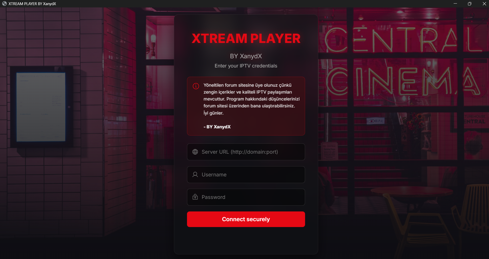
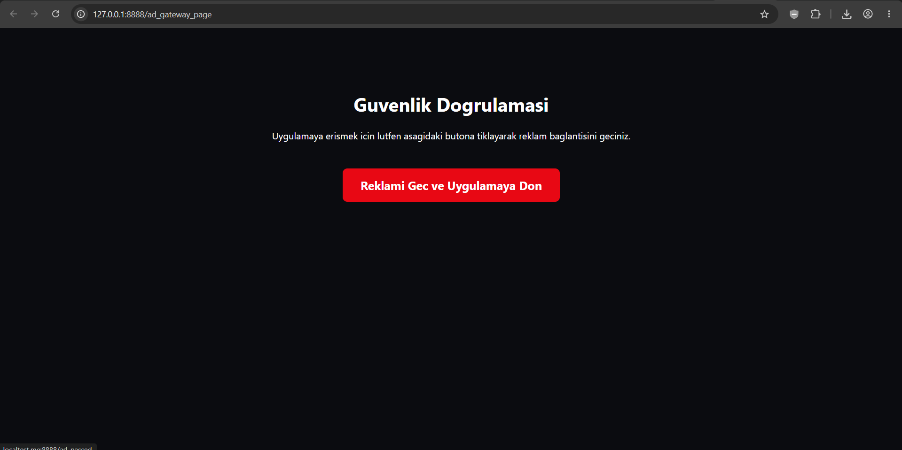
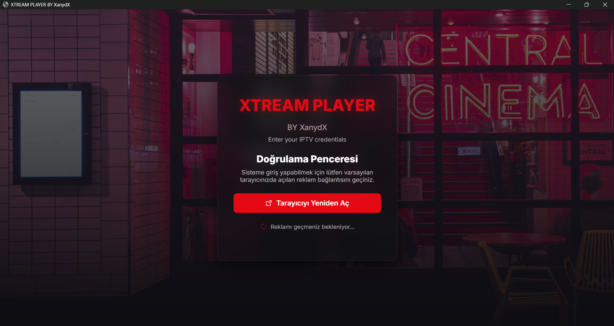
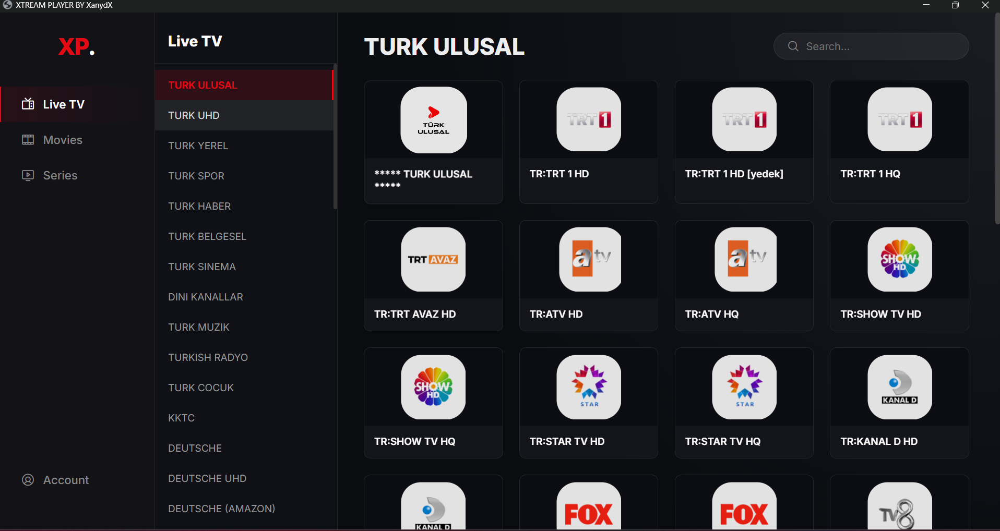
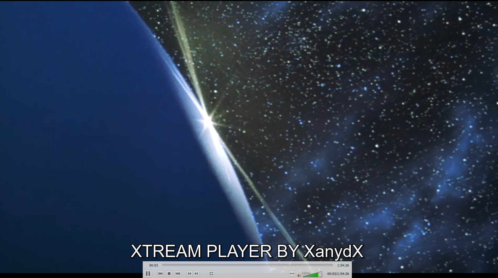

<div align="center">

<!-- Logo -->


# Xtream Player

### ✨ Python ile Geliştirilmiş, Modern ve Şık Tasarımlı IPTV Oynatıcı ✨

[](https://www.python.org)
[](https://opensource.org/licenses/MIT)
[]()

---

**Xtream Player**, alışılagelmiş demode IPTV arayüzlerini geride bırakan, kullanıcı deneyimi odaklı, hızlı ve modern bir medya oynatıcıdır. Güçlü altyapısı ve sinematik tasarımıyla IPTV izleme keyfini bir üst seviyeye taşır.

[Özellikler](#-özellikler) • [Ekran Görüntüleri](#-ekran-görüntüleri) • [Kurulum](#%EF%B8%8F-kurulum) • [Kullanım](#-kullanım)

</div>

---

## 📸 Ekran Görüntüleri

Projenin modern arayüzüne ve tasarım detaylarına göz atın:

<table width="100%">
  <tr>
    <td width="50%">
      <p align="center"><b>🖥️ Ana Panel / Giriş</b></p>
      
    </td>
    <td width="50%">
      <p align="center"><b>📺 Canlı Yayın İzleme</b></p>
      
    </td>
  </tr>
  <tr>
    <td width="50%">
      <p align="center"><b>🎬 Sinematik Film Modu</b></p>
      
    </td>
    <td width="50%">
      <p align="center"><b>🍿 Dizi & Sezon Seçimi</b></p>
      
    </td>
  </tr>
</table>

<br>

<p align="center">
  <b>⚙️ Gelişmiş Ayarlar Menüsü</b><br>
  
</p>

---

## 🚀 Özellikler

*   **Modern ve Dinamik UI:** Alışılmışın dışında, akıcı ve göze hitap eden özel arayüz tasarımı.
*   **Hızlı Xtream API Entegrasyonu:** Listenizi saniyeler içinde yükleyin ve kategorize edin.
*   **Akıllı Kategorizasyon:** Canlı Yayınlar, Filmler ve Diziler otomatik olarak ayrıştırılır.
*   **Gelişmiş Oynatıcı Kontrolleri:** Tam ekran modu, ses/parlaklık kontrolleri ve akıcı oynatma.
*   **Hafif ve Performanslı:** Donma veya kasma yapmadan minimum RAM kullanımı ile çalışır.

---

## 🛠️ Kurulum

Projeyi yerel bilgisayarınızda çalıştırmak için aşağıdaki adımları takip edebilirsiniz:

### 1. Depoyu Klonlayın
```bash
git clone [https://github.com/kullanici_adi/proje_adi.git](https://github.com/kullanici_adi/proje_adi.git)
cd proje_adi
